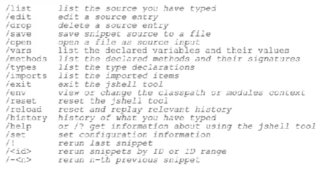

def. An interactive Read-Evaluate-Print Loop (REPL) command-line tools

JShell evaluates declarations, statements, and expressions as they are entered and results are shown immediately.

Use Example:

        **$ jshell**
        **jshell>** int x=1
        x==> 1
        **jshell>** int y=1
        y==> 1
        **jshell>** x+y
        $3 ==> 2
        **jshell>**/exit
        **$**

Command Reference

Links:

    https://docs.oracle.com/en/java/javase/21/jshell/introduction-jshell.html

    https://www.youtube.com/watch?v=mMnWwlIXLIY